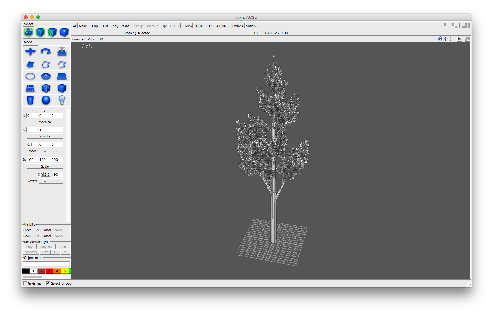

# tree-generator

This tool was built as part of a final year project at the University of Manchester. 
The project was to inspire school-age children to consider taking Computer Science as a subject in higher education. 
This was done by devising an activity where the attendees could construct a 'virtual world' in the Unreal Engine 
that they could then explore using the Oculus Rift headset. The educational aims were to demonstrate
procedurally generated content and also (through that) recursion. This tool has an implementation of 
Peter E. Oppenheimer's recursive algorithm in his paper *Real Time Design and Animation of Fractal Plants and Trees*.
 
 

## Installation

To install this tool all you need is to install the dependencies below. You can then download the project and either run
it from the command line (`python ./run_generator.py`) or by double clicking on the Python file `run_generator.py` or 
creating a desktop shortcut.

## Dependencies

The tool requires the following to run:

* [Python 3](https://www.python.org)
* [PyQt4](http://www.riverbankcomputing.co.uk/software/pyqt/intro)
* [NumPy](http://www.numpy.org), you can also install it by running `pip install numpy`.

## Usage

You can find details on how to use this tool on the [Usage](USAGE.md) page.