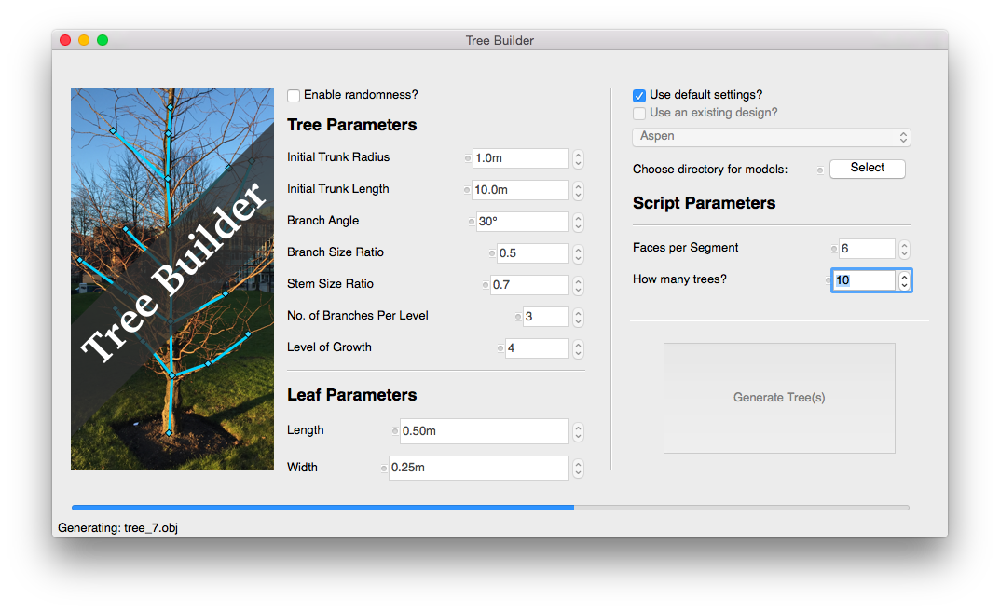

# ``run_generator`` script usage

`run_generator [-d|--design filename] [-c|--cli] [-r|--random] [-t|--test]`

Options:
`-c | --cli`: Runs script on the command line rather than the GUI
`-d | --design`: Specify a .ini file for the tree generator to use (by default uses default.ini)
`-r | --random`: Enables randomness in the tree generation process
`-t | --test`: Runs the doctests in USAGE.md

# GUI guide

The settings in the GUI (Graphical User Interface) do the following:

* **Enable Randomness**: Turns on normal distribution-based randomness for some aspects of the tree creation.
* **Use default settings?**: Uses the default design file (the values shown in the GUI on startup).
* **Use an existing design?**: Use a pre-made design file from the drop down menu (new design files can be created as shown in the next section).
* **Choose a directory for models**: Select the directory where the tree models will be placed.

## Tree Parameters

* **Initial Trunk Radius**: How 'thick' the trunk will initially be.
* **Initial Trunk Length**: How 'long' the first segment of trunk will be, a higher value means a tree with a longer trunk and branches.
* **Branch Angle**: The angle between the segments of trunk and branches coming from it.
* **Branch Size Ratio**: The ratio between the trunk dimensions and new branches coming from it.
* **Stem Size Ratio**: The size ratio between segments of stem (in trunk or branches).
* **No. of Branches Per Level**: The number of branches coming from each segment of stem (trunk).
* **Level of Growth**: Controls the recursive depth of the algorithm, a higher value will generate trees that look 'more grown' but will take significantly longer to generate.

## Leaf Parameters

* **Length**: The length of the leaf.
* **Width**: The width of the leaf.

## Script Parameters

* **Faces per Segment**: How many faces make up each segment (the higher the value the more 'rounded' the tree will appear.
* **How many trees?**: How many trees the run of the script should produce.

# Creating new tree designs

Tree designs are stored in the `designs` directory. You can create a new design by creating a new `.ini` file.
The basic template for this is as follows:

    [details]
    design_name=<name>
    author=<author>
    version=0.0
    
    [params]
    radius=1
    faces=6
    length=10
    branch_angle=30
    branch_ratio=0.5
    stem_ratio=0.7
    branch_per_stem=3
    max_depth=4
    
    leaf_length=0.5
    leaf_width=0.25

All the `[params]` items are required, as is the `design_name` field. The other items in `[details]` are optional.

# ``obj`` module

## Using ``Vertex``

Create Vertex objects with the x, y, and z coordinates. Fourth argument is the sequence in the file for the vertex.

    >>> from obj import Vertex
    >>> v1 = Vertex(1, 2, 3, 0)
    >>> v1.x
    1
    >>> v1.y
    2
    >>> v1.z
    3
    >>> v2 = Vertex(2, 2, 2, 1)
    >>> print(v1)
    v 1 2 3

## Using ``Face``

Face objects are formed of Vertex objects. A Face consists of at least three Vertex objects.

    >>> from obj import Face
    >>> vertex_nums = [0, 1]
    >>> face = Face(vertex_nums)
    Traceback (most recent call last):
        ...
    Exception: A face must have at least three vertices
    >>> vertex_nums = [0, 1, 2]
    >>> face = Face(vertex_nums)
    >>> print(face)
    f 0 1 2

## Using ``ObjWriter``

The ObjWriter is used to write to the output file. Vertices and Faces are added to it and then written out.

    >>> from obj import ObjWriter
    >>> writer = ObjWriter("some-file.obj")
    >>> vertices = []
    >>> vertices.append(writer.add_vertex(1, 1, 1))
    >>> vertices.append(writer.add_vertex(2, 2, 2))
    >>> writer.add_face(vertices)
    Traceback (most recent call last):
        ...
    Exception: A face must have at least three vertices
    >>> vertices.append(writer.add_vertex(3, 3, 3))
    >>> writer.write_vertices()
    >>> writer.close()
    >>> with open("some-file.obj", 'r') as obj_file:
    ...     print(obj_file.read())
    v 1 1 1
    v 2 2 2
    v 3 3 3
    <BLANKLINE>
    >>> writer = ObjWriter("some-file.obj")
    >>> vertices = []
    >>> vertices.append(writer.add_vertex(1, 1, 1))
    >>> vertices.append(writer.add_vertex(2, 2, 2))
    >>> vertices.append(writer.add_vertex(3, 3, 3))
    >>> writer.add_face(vertices)
    >>> writer.add_face(vertices, "group")
    >>> writer.write_faces()
    >>> writer.close()
    >>> with open("some-file.obj", 'r') as obj_file:
    ...     print(obj_file.read())
    f 1 2 3
    g group
    f 1 2 3
    <BLANKLINE>
    >>> import os
    >>> os.remove("some-file.obj")
    
# ``tree_gen`` module

## Using ``generate``

Call the generate function to generate a tree model
    
    >>> from tree_gen import generate
    >>> generate("designs/default.ini", False)
    >>> with open('tree.obj') as obj_file:
    ...     print(sum(1 for _ in obj_file))
    17657
    >>> import os
    >>> os.remove("tree.obj")
